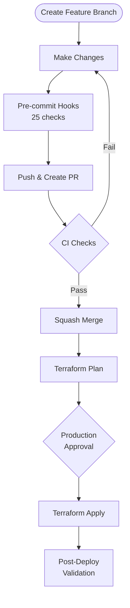
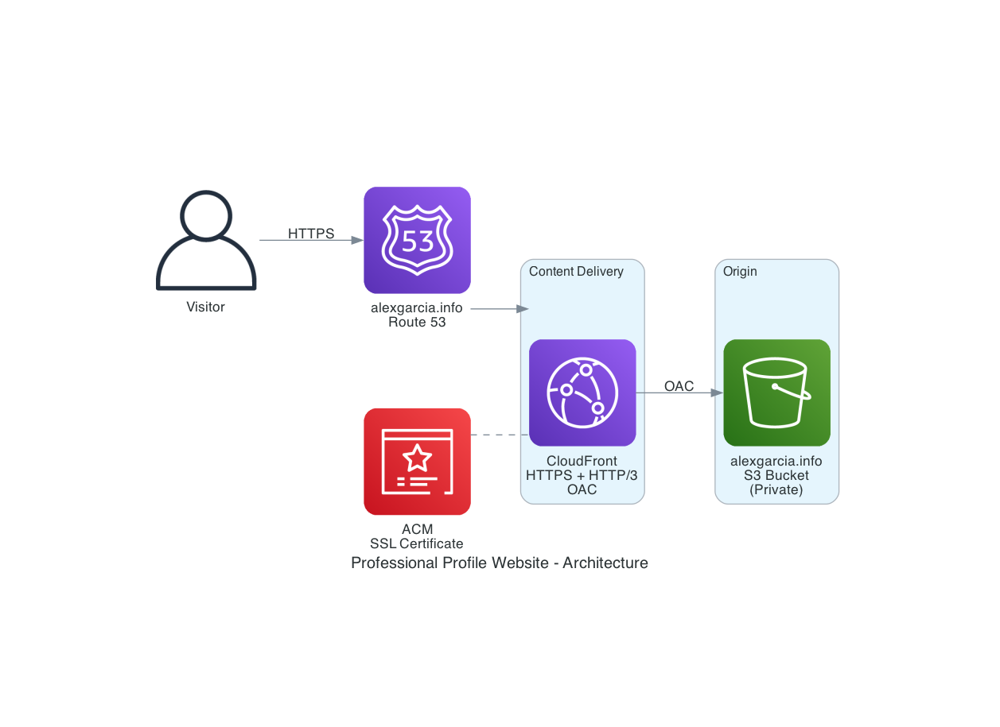
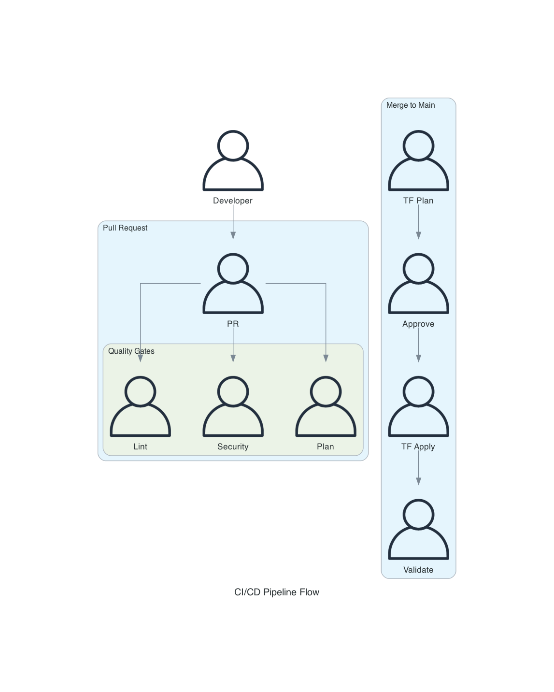
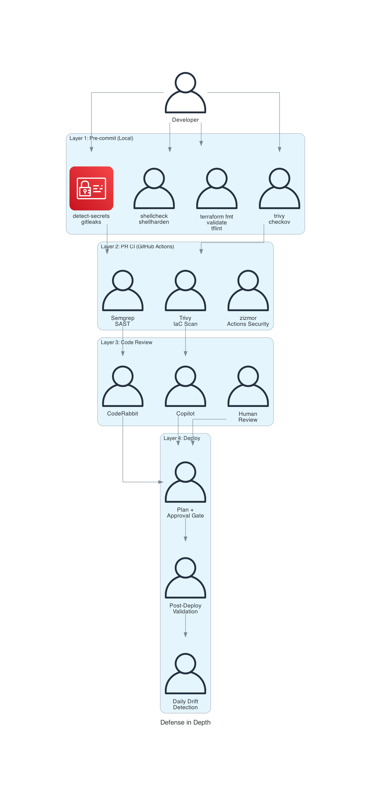

# Professional Profile — Infrastructure


Terraform infrastructure for the professional profile website at
[alexgarcia.info](https://alexgarcia.info).

## Prerequisites

- [Terraform](https://developer.hashicorp.com/terraform/install) >= 1.5
- [TFLint](https://github.com/terraform-linters/tflint)
- [pre-commit](https://pre-commit.com/#install)
- [Trivy](https://aquasecurity.github.io/trivy/)
- [shellcheck](https://www.shellcheck.net/) and
  [shellharden](https://github.com/anordal/shellharden)
- [Vale](https://vale.sh/) and [gitleaks](https://github.com/gitleaks/gitleaks)
- AWS CLI v2 configured with SSO profile `personal`

## Local Development Setup

```bash
# 1. Authenticate
aws sso login --profile personal

# 2. Install pre-commit hooks (25 checks)
pre-commit install
vale sync

# 3. Initialize Terraform
cd terraform/website
terraform init -backend-config="profile=personal"

# 4. Verify
pre-commit run --all-files
terraform validate
terraform plan
```

## Repository Structure

```text
terraform/
  website/                        # Website infrastructure
    main.tf                       # Root module configuration
    variables.tf                  # Input variables
    outputs.tf                    # Output values
    providers.tf                  # Provider configuration
    backend.tf                    # S3 state backend
    terraform.tfvars.example      # Variable template
    modules/
      static-site/                # S3 + CloudFront + Route 53 module
        main.tf
        variables.tf
        outputs.tf
        .terraform-docs.yml       # Auto-doc generation config
docs/
  architecture.md                 # Architecture and security design
  adr/                            # Architecture Decision Records (5)
  github-oidc-setup.md            # OIDC authentication guide
  github-variables-setup.md       # GitHub variables guide
  prerequisites.md                # Setup prerequisites
.claude/
  settings.json                   # Claude Code hooks config
  hooks/                          # Post-edit and protect hooks
  skills/ship/                    # /ship PR lifecycle skill
.github/
  actions/                        # Composite actions (5)
  scripts/                        # Shell scripts (7)
  workflows/                      # CI/CD pipelines (6)
  ISSUE_TEMPLATE/                 # Issue templates
  PULL_REQUEST_TEMPLATE.md
  copilot-instructions.md
  dependabot.yml
```

## Infrastructure

| Resource | Description |
| --- | --- |
| S3 Bucket | `alexgarcia.info` — private, CloudFront OAC access only |
| CloudFront | CDN with HTTPS redirect, HTTP/2+3, custom error pages |
| Route 53 | DNS management for `alexgarcia.info` |
| ACM | SSL/TLS certificate (us-east-1) |

## Getting Started

1. **Complete prerequisites**: See [docs/prerequisites.md](docs/prerequisites.md)
2. **Set up GitHub OIDC**: See
   [docs/github-oidc-setup.md](docs/github-oidc-setup.md)
3. **Configure GitHub variables**: See
   [docs/github-variables-setup.md](docs/github-variables-setup.md)
4. **Create `terraform.tfvars`** from the example:

```bash
cp terraform/website/terraform.tfvars.example terraform/website/terraform.tfvars
# Edit with your values (aws_profile = "personal")
```

## Development Workflow



## CI/CD Pipeline

| Workflow | Trigger | Purpose |
| --- | --- | --- |
| `terraform-pr.yml` | PR with `terraform/` changes | Lint, security, plan, cost estimate |
| `terraform-cicd.yml` | Push to main | Plan, approval gate, apply, validation |
| `drift-detection.yml` | Daily 9 AM UTC | Detect infrastructure drift |
| `quality-checks.yml` | Every PR and push | Markdown, YAML, shell, prose, zizmor |
| `security.yml` | Every PR and push | Semgrep SAST + Trivy IaC scan |
| `update-pre-commit-hooks.yml` | Weekly (Sunday) | Auto-update hook versions |

## Authentication

GitHub Actions authenticates via OIDC — no static credentials:

- **IAM Role**: `GitHubActions-ProfessionalProfileIaC`
- **Policies**: WebsiteInfraManagement (scoped), TerraformStateAccess
- **Trust**: Restricted to `repo:gamaware/professional-profile-iac:*`

## Defense in Depth

Security checks at every stage of the development lifecycle:

1. **Pre-commit**: detect-secrets, gitleaks, shellcheck, shellharden,
   terraform\_validate, terraform\_tflint, terraform\_trivy, terraform\_checkov
2. **PR CI**: Semgrep SAST, Trivy IaC scanning, TFLint, Checkov, zizmor
3. **Code Review**: CodeRabbit (auto), Copilot (auto), human (required)
4. **Deploy**: Terraform plan review, production approval gate
5. **Post-deploy**: S3, CloudFront, website health validation
6. **Scheduled**: Daily drift detection with automatic issue creation

## Architecture Diagrams

| Diagram | Description |
| --- | --- |
|  | Website infrastructure |
|  | CI/CD pipeline flow |
|  | Defense in depth layers |

## Quick Links

| Resource | Link |
| --- | --- |
| Architecture | [docs/architecture.md](docs/architecture.md) |
| ADRs | [docs/adr/](docs/adr/README.md) |
| OIDC Setup | [docs/github-oidc-setup.md](docs/github-oidc-setup.md) |
| Prerequisites | [docs/prerequisites.md](docs/prerequisites.md) |
| Site Repo | [professional-profile-site](https://github.com/gamaware/professional-profile-site) |

## License

[MIT](LICENSE)

## Author

Alex Garcia — [gamaware@gmail.com](mailto:gamaware@gmail.com)
