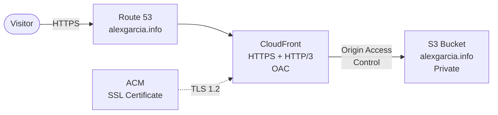
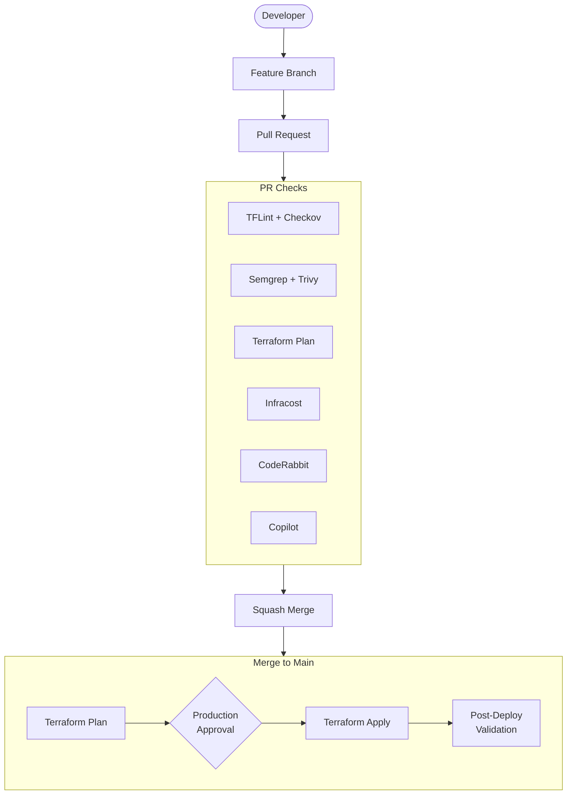
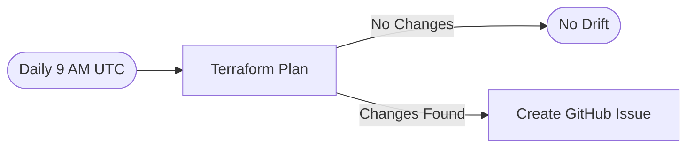

# Architecture

## Infrastructure Overview

The professional profile website at `alexgarcia.info` runs on a fully
managed AWS static site stack:

## Security Architecture

Traffic flows through multiple security layers:

1. **DNS**: Route 53 managed hosted zone
2. **CDN**: CloudFront with HTTPS redirect, TLS 1.2 minimum
3. **Origin**: S3 bucket fully private, accessible only via CloudFront OAC
4. **Certificate**: ACM-managed SSL/TLS certificate

## CI/CD Pipeline

## Drift Detection

## Authentication

GitHub Actions authenticates to AWS via OIDC (OpenID Connect):

- No long-lived credentials stored in GitHub
- IAM role scoped to website resources only
- Trust policy restricts to this repository
- Tokens expire automatically

## Terraform State

- **Bucket**: `terraform-state-professional-profile-<ACCOUNT_ID>`
- **Encryption**: AES-256 at rest
- **Versioning**: Enabled for state recovery
- **Locking**: Native S3 lockfile
- **Public access**: Fully blocked
