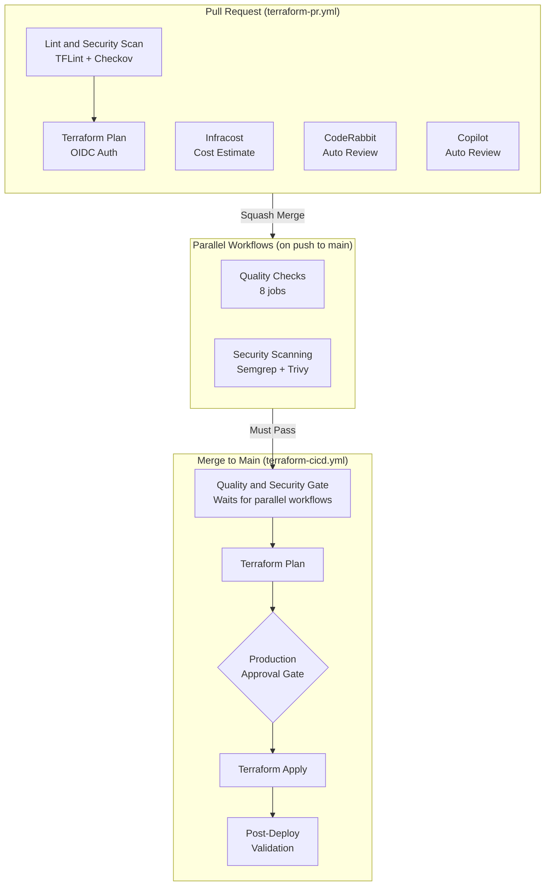
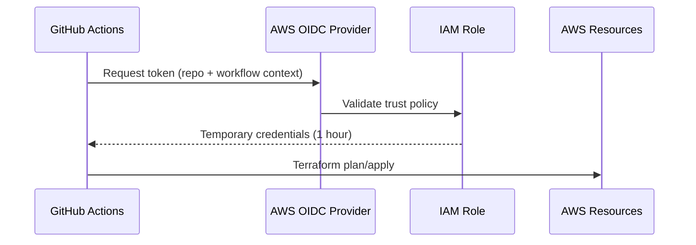

# CI/CD Pipeline Flow

Detailed documentation of the CI/CD pipeline for the professional profile
infrastructure repository.

## Pipeline Overview

The repository uses six GitHub Actions workflows that work together to
validate, secure, and deploy infrastructure changes.

## Workflow Details

### 1. Quality Checks (`quality-checks.yml`)

**Triggers:** Every push to main and every PR

Runs 8 parallel jobs, each posting a `$GITHUB_STEP_SUMMARY`:

| Job | Tool | Purpose |
| --- | --- | --- |
| Markdown Linting | markdownlint-cli2 | Markdown syntax and style |
| Check Links | markdown-link-check | Broken link detection |
| Shell Script Validation | ShellCheck | Shell script errors |
| YAML Validation | yamllint | YAML syntax |
| Validate Repository Structure | custom script | Required files and directories |
| README Quality Check | custom script | Sections, badges, author, license |
| Actions Security | zizmor | GitHub Actions security audit |
| Prose Linting | Vale | Grammar and style (write-good, proselint) |

### 2. Security Scanning (`security.yml`)

**Triggers:** Every push to main and every PR

| Job | Tool | Purpose |
| --- | --- | --- |
| Semgrep SAST | Semgrep | Static analysis with `p/default` and `p/terraform` configs |
| Trivy IaC Scan | Trivy | Infrastructure misconfiguration scanning (HIGH/CRITICAL) |

### 3. Terraform PR Checks (`terraform-pr.yml`)

**Triggers:** PRs with changes to `terraform/**`

| Job | Dependencies | Purpose |
| --- | --- | --- |
| Lint and Security Scan | None | TFLint + Checkov via composite action |
| Terraform Plan | Lint passes | Plan with OIDC auth, posts plan as PR comment |
| Infracost Cost Estimate | None | Cost breakdown posted as PR comment |

The plan output is posted as a collapsible comment on the PR for review
before merge.

### 4. Terraform CI/CD (`terraform-cicd.yml`)

**Triggers:** Push to main with `terraform/**` changes, or manual
`workflow_dispatch`

This is the deploy pipeline with three stages:

#### Stage 1: Quality and Security Gate

The gate job polls the GitHub API every 10 seconds (up to 5 minutes)
waiting for both Quality Checks and Security Scanning workflows to
complete successfully on the same commit SHA.

- If **both pass**: Terraform Plan proceeds
- If **either fails**: Pipeline is blocked, no plan or apply runs
- If **timeout**: Pipeline is blocked
- **Manual dispatch**: Skips the gate entirely

This ensures no infrastructure changes are applied unless the code passes
all quality and security checks, even though the workflows run in parallel.

#### Stage 2: Terraform Plan

Runs `terraform plan` with OIDC authentication. The plan artifact is
saved for the apply step (no re-planning).

#### Stage 3: Terraform Apply (with production approval gate)

The apply job requires manual approval via the `production` GitHub
environment. This is a human checkpoint before any infrastructure
changes are applied.

After apply completes, the post-deployment validation script runs
13 checks:

- S3 bucket existence
- S3 public access block configured
- S3 website configuration
- S3 bucket policy uses CloudFront service principal
- S3 bucket policy has no public access
- CloudFront distribution status (Deployed)
- CloudFront Origin Access Control configured
- CloudFront viewer protocol (redirect-to-https)
- CloudFront alias matches domain
- CloudFront ACM certificate configured
- Website responds on HTTPS
- HTTP redirects to HTTPS
- ACM certificate status (ISSUED)

#### Destroy (manual only)

Triggered via `workflow_dispatch` with `action=destroy`. Requires
production environment approval. Post-destroy validation checks that
S3 bucket, CloudFront distribution, and Route 53 records are removed.

### 5. Drift Detection (`drift-detection.yml`)

**Triggers:** Daily at 9 AM UTC (cron), or manual

Runs `terraform plan` against live infrastructure. If changes are
detected (exit code 2), a GitHub issue is created or updated with
the `drift` label.

### 6. Update Pre-commit Hooks (`update-pre-commit-hooks.yml`)

**Triggers:** Weekly on Sunday at midnight UTC, or manual

Runs `pre-commit autoupdate` and creates a PR with version bumps.

## Authentication

All AWS access uses OIDC (OpenID Connect) — no static credentials:

- **IAM Role**: `GitHubActions-ProfessionalProfileIaC`
- **Trust**: Restricted to `repo:gamaware/professional-profile-iac:*`
- **Policies**: WebsiteInfraManagement (scoped to S3, CloudFront, ACM,
  Route 53) and TerraformStateAccess (scoped to state bucket)

## Concurrency Control

- **`terraform-state`** group: Prevents simultaneous Terraform runs
  (plan, apply, destroy, drift detection all share this group)
- **`terraform-pr-{number}`** group: Cancels previous PR check runs
  when new commits are pushed
- **`security-{PR# || ref}`** group: Cancels previous security scans
  (keyed by PR number for PRs, by ref for pushes)
- **`pre-commit-update`** group: Prevents concurrent hook updates
- **`deploy`** group (site repo): Prevents concurrent deploys

## Pre-commit Hooks (Local)

Before any commit, hooks validate the code locally:

| Category | Hooks |
| --- | --- |
| General | trailing-whitespace, end-of-file-fixer, check-yaml, check-json, check-added-large-files, check-merge-conflict, detect-private-key, check-executables-have-shebangs, check-shebang-scripts-are-executable, check-symlinks, check-case-conflict, no-commit-to-branch |
| Secrets | detect-secrets, gitleaks |
| Terraform | terraform\_fmt, terraform\_validate, terraform\_tflint, terraform\_docs, terraform\_trivy, terraform\_checkov |
| Shell | shellcheck, shellharden |
| Markdown | markdownlint |
| Prose | Vale |
| Actions | actionlint, zizmor |
| Commits | conventional-pre-commit |

## Code Review

Every PR receives automated reviews from:

- **CodeRabbit**: Path-specific instructions for Terraform, workflows,
  modules, CLAUDE.md, and scripts
- **GitHub Copilot**: Priorities include security, Terraform best practices,
  state management, cost awareness, and least privilege

Both must have no unaddressed comments before merge.

## Composite Actions

Reusable composite actions encapsulate complex multi-step operations:

| Action | Purpose |
| --- | --- |
| `terraform-composite` | OIDC auth, init, format, validate, plan/apply/destroy |
| `lint-and-security-composite` | TFLint + Checkov |
| `post-deploy-validation-composite` | Get outputs + validate deployment |
| `drift-detection-composite` | OIDC auth, plan, check drift, create issue |
| `quality-gate-composite` | Wait for quality + security workflows |
| `update-pre-commit-composite` | Autoupdate hooks, create PR |

## Shell Scripts

All CI logic is in external scripts for testability:

| Script | Purpose |
| --- | --- |
| `terraform-plan.sh` | Plan with exit code handling and step summary |
| `drift-plan.sh` | Plan for drift detection |
| `drift-check.sh` | Evaluate drift exit code |
| `drift-issue.sh` | Create or update drift GitHub issue |
| `get-terraform-outputs.sh` | Read Terraform outputs |
| `validate-deployment.sh` | 13-check post-deploy validation |
| `validate-destroy.sh` | Post-destroy verification |
| `quality-gate.sh` | Wait for parallel workflow completion |
